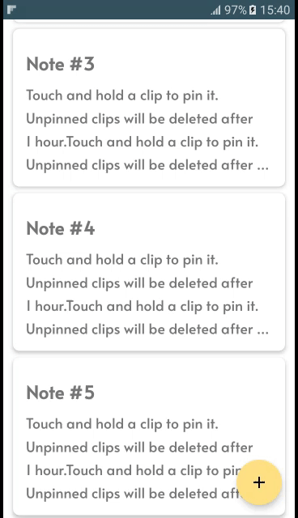
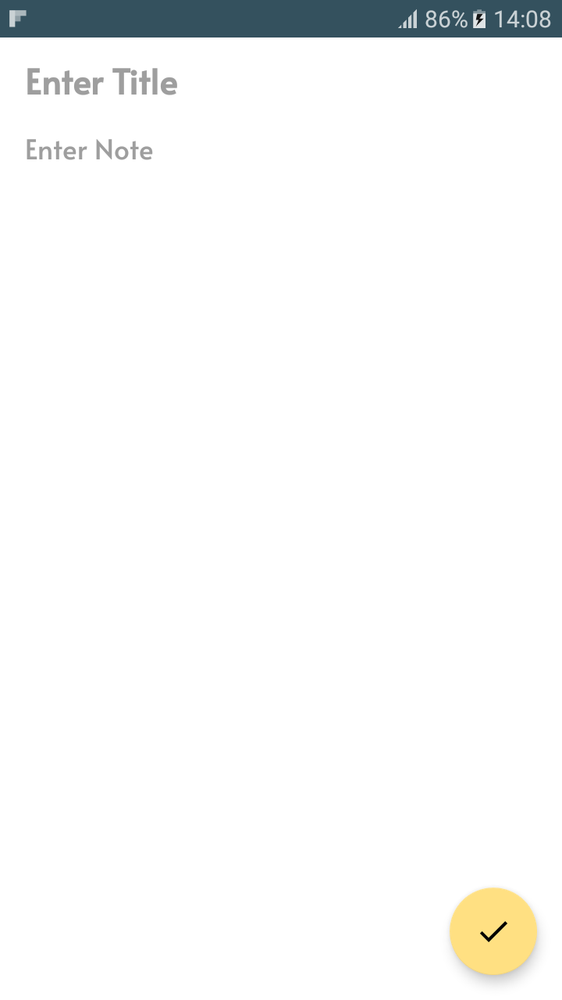

# AppNote

AppNote is a simple note app where you can add, update and delete notes.

## Architecture

AppNote is written with the SOLID principles and the [recommended architecture](https://developer.android.com/topic/architecture) by Google.
All notes are stored in a local database managed by [RoomDatabase](https://developer.android.com/training/data-storage/room). Repositories are defined
as interfaces to be later implemented by production and testing code. Business logic is separated from the UI inside a ViewModel. And
finally, [Hilt](https://dagger.dev/hilt/) modules inject necessary classes to the respective consumers.

## Animations

To achieve beautiful transition animations, AppNote uses the [Material Motion](https://m2.material.io/develop/android/theming/motion) library which
offers a set of transition patterns that help users navigate the app.

## Screenshots

    
    
    
    

## Tests

Tests are implemented with [Espresso](https://developer.android.com/training/testing/espresso) and [Robolectric](https://robolectric.org/).